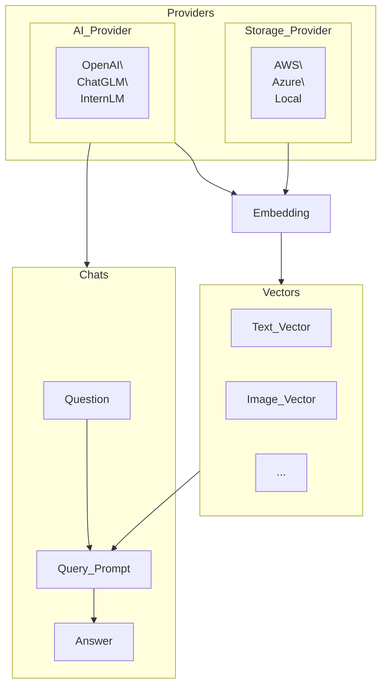

As Casibase's user, you should get familiar with at least 4 core concepts: `Provider`, `Storage`, `Chat` and `Vector`.



## Provider

Providers are the backbone of Casibase, offering essential services and integration with external systems. The Provider class definition is shown as follows:

```go
type Provider struct {
    Owner       string `xorm:"varchar(100) notnull pk" json:"owner"`
    Name        string `xorm:"varchar(100) notnull pk" json:"name"`
    CreatedTime string `xorm:"varchar(100)" json:"createdTime"`

    DisplayName  string `xorm:"varchar(100)" json:"displayName"`
    Category     string `xorm:"varchar(100)" json:"category"`
    Type         string `xorm:"varchar(100)" json:"type"`
    ClientId     string `xorm:"varchar(100)" json:"clientId"`
    ClientSecret string `xorm:"varchar(2000)" json:"clientSecret"`
    ProviderUrl  string `xorm:"varchar(200)" json:"providerUrl"`
}
```

:::tip

There are two primary types of providers in Casibase:

- **Storage Provider:**The Storage Provider facilitates the storage and retrieval of data within Casibase. It supports various storage options, including:
  - AWS
  - Azure
  - Local File System

- **AI Provider:**The AI Provider is responsible for handling AI-related tasks and services in Casibase. It supports multiple AI models and technologies, including:
  - OpenAI
  - ChatGLM
  - InternLM

:::

## Vectors

Vectors in Casibase represent numerical representations of different types of data. These vectors enable efficient processing and analysis of information. Some of the vector types available are:

- Text Vector
- Image Vector
- ... (other vector types)

The Vector class definition is shown as follows:

```go
type Vector struct {
    Owner       string    `xorm:"varchar(100) notnull pk" json:"owner"`
    Name        string    `xorm:"varchar(100) notnull pk" json:"name"`
    CreatedTime string    `xorm:"varchar(100)" json:"createdTime"`

    DisplayName string    `xorm:"varchar(100)" json:"displayName"`
    Store       string    `xorm:"varchar(100)" json:"store"`
    File        string    `xorm:"varchar(100)" json:"file"`
    Text        string    `xorm:"mediumtext" json:"text"`
    Data        []float64 `xorm:"mediumtext" json:"data"`
}
```

## Chats

Chats are at the core of interactive communication between users and the AI models in Casibase. They consist of three essential components:

- Question: The user's input or query, seeking information or assistance.
- Query Prompt: A formatted version of the user's question, prepared for processing by the AI models.
- Answer: The AI-generated response to the user's question, providing relevant information or solutions.

The Chat class definition is shown as follows:

```go
type Chat struct {
    Owner        string   `xorm:"varchar(100) notnull pk" json:"owner"`
    Name         string   `xorm:"varchar(100) notnull pk" json:"name"`
    CreatedTime  string   `xorm:"varchar(100)" json:"createdTime"`
    UpdatedTime  string   `xorm:"varchar(100)" json:"updatedTime"`

    DisplayName  string   `xorm:"varchar(100)" json:"displayName"`
    Category     string   `xorm:"varchar(100)" json:"category"`
    Type         string   `xorm:"varchar(100)" json:"type"`
    User1        string   `xorm:"varchar(100)" json:"user1"`
    User2        string   `xorm:"varchar(100)" json:"user2"`
    Users        []string `xorm:"varchar(100)" json:"users"`
    MessageCount int      `json:"messageCount"`
}
```

## Embedding

Embedding is the process of transforming various types of data, such as text and images, into dense vector representations. This step is crucial for facilitating efficient data processing and analysis within Casibase.

:::tip

- By embedding, the questions in chat and the knowledge files in storage will be turned into vectors and used in the next step of knowledge search.

- Casibase's default embedding method is provided by OpenAI at a rate of up to three calls per minute. We propose to minimize the knowledge file coupling as much as possible to facilitate embedding and further processing.

:::
